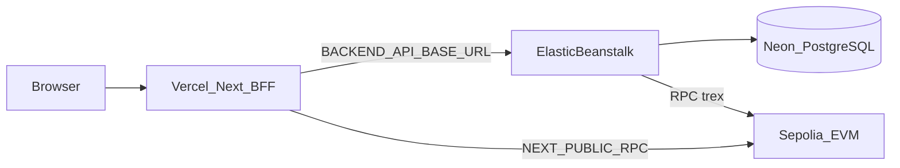

# ADR-013: Production Deployment Topology

**Status:** Accepted  
**Date:** 2026-08-24  
**Decision owners:** DevOps, Architecture

## Context

VaultGuard RWA requires a production-ready deployment strategy that separates concerns, maintains security boundaries, and supports the three-tier architecture (blockchain, backend, frontend) across cloud providers. The deployment must enforce the principle that signing keys never reach the browser and that each tier can scale independently.

## Decision

Use a three-stage deployment topology:

1. **Blockchain (Sepolia/Mainnet)**: Deploy T-REX contracts via Foundry with shared IdentityRegistry and per-offering token suites
2. **Backend (AWS Elastic Beanstalk)**: Spring Boot API with Neon PostgreSQL, holding admin private key and oracle worker
3. **Frontend (Vercel)**: Next.js with BFF pattern, HttpOnly JWT cookies, no signing keys

### Deployment order

1. **Blockchain** → `npm run deploy:sepolia` (addresses in `deployments/11155111.json`)
2. **Backend** → `mvn package` + zip Procfile+JAR → Elastic Beanstalk
3. **Frontend** → PR to GitHub → Vercel Preview → Production

### Environment matrix

| Variable                                  | EB  | Vercel | Notes                               |
| ----------------------------------------- | --- | ------ | ----------------------------------- |
| `SPRING_PROFILES_ACTIVE=production`       | ✓   | —      |                                     |
| `SPRING_DATASOURCE_*`                     | ✓   | —      | Rotate Neon password before go-live |
| `CORS_ALLOWED_ORIGINS`                    | ✓   | —      | Vercel HTTPS origin(s)              |
| `RPC_URL` / `CHAIN_ID` / IR + token + MC  | ✓   | —      | MC only on EB (`trex`)              |
| `APP_BLOCKCHAIN_REQUIRE_KMS_SIGNER=false` | ✓   | —      | KMS stub not EIP-155 yet            |
| `APP_BLOCKCHAIN_ADMIN_PRIVATE_KEY`        | ✓   | —      | Never commit / never on Vercel      |
| `APP_AUTH_JWT_SECRET` + docs encryption   | ✓   | —      | Never on Vercel                     |
| `BACKEND_API_BASE_URL`                    | —   | ✓      | EB HTTPS origin                     |
| `NEXT_PUBLIC_CHAIN_ID` / RPC / IR / token | —   | ✓      | Sepolia `11155111`; must match EB   |

## Consequences

### Positive

- Clear separation of secrets: admin keys only on backend, no signing keys on Vercel
- Independent scaling: frontend auto-scales via Vercel, backend via EB auto-scaling groups
- Testnet-to-mainnet path is identical (change RPC + addresses)
- BFF security boundary prevents client-side JWT/key exposure

### Negative

- Multi-cloud complexity (AWS + Vercel + Alchemy/Infura)
- Backend must hold admin private key until KMS/HSM signing is production-ready
- Cross-region latency between EB and Vercel (mitigated by edge functions)

### Security checklist before first public URL

1. Rotate Neon DB password (value was used in local/dev)
2. Generate new JWT and document encryption key on EB
3. Do not commit Sepolia private keys or Alchemy API keys
4. Confirm frontend has no secrets in client bundle (`publicRuntime` only)
5. EB health check: `/actuator/health/readiness`
6. Mainnet blocked until real KMS signing + external audit

## References

- `README.md` — First production-oriented deploy
- `_docs/TECHNICAL.md` section 10 — Deploy & ops
- ADR-006 — Production Readiness and Deployment Order
- ADR-012 — Deployment Orchestration and Environment Matrix