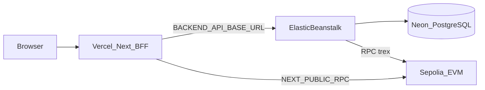

# RWA Tokenized Compliance Platform

Base documentation repository for the RWA Tokenized Compliance System — a production-oriented **marketplace** for regulated RWA tokenization: admin-created contracts (PUBLIC / PRIVATE), off-chain KYC/AML (Java), on-chain transfer enforcement (EVM). Aligned with **EU MiCA**, **GDPR**, **AML/KYC**, and **ERC-3643**.

GitHub (Main): <https://github.com/andreilopes11/rwa-tokenized-compliance-platform.git>

## Compliance & security

| Area            | Capability                                                                     |
| --------------- | ------------------------------------------------------------------------------ |
| **Marketplace** | Admin-only contract create; PUBLIC (all investors) or PRIVATE (admin-selected) |
| **Identity**    | Off-chain KYC/AML, document hashing, wallet-bound sessions                     |
| **On-chain**    | Permissioned transfers via ERC-3643 / T-REX                                    |
| **Governance**  | Issuer console, audit events, pause/unpause, admin authorization               |
| **Regulation**  | MiCA-oriented workflows, GDPR data minimization                                |

Full specification:

- Functional: [`_docs/FUNCTIONAL.md`](_docs/FUNCTIONAL.md)
- Technical: [`_docs/TECHNICAL.md`](_docs/TECHNICAL.md)
- Index: [`_docs/README.md`](_docs/README.md)

## System overview

This repository contains the **normative specifications** and **architectural decisions** for the RWA Tokenized Compliance System.

```text
Investor / Super Admin
				 |
Next.js workspaces + BFF (HttpOnly JWT cookies)
				 |
Spring Boot API (role, scope, tenant, ownership, linkage)
				 |
PostgreSQL | KYC adapter | Oracle worker | Blockchain Gateway
				 |
EVM T-REX (shared IdentityRegistry, per-offering Token + ModularCompliance)
```

### Production deployment architecture



See the [C4 diagrams](Diagrams/) and the [architecture decisions](ADRs/) for detailed views.

## Repository structure

| Path                                    | Role                                                                              |
| --------------------------------------- | --------------------------------------------------------------------------------- |
| [`_docs`](_docs/)                       | Normative product, functional, technical and phased implementation specifications |
| [`ADRs`](ADRs/)                         | Accepted architectural decisions and their consequences                           |
| [`Diagrams`](Diagrams/)                 | PlantUML C4 context, container and component views                                |
| [`Execution Guide`](Execution%20Guide/) | Execution and operational guidance                                                |

## Implementation repositories

The system is split across independent deployable units:

| Repository                                                                                                                | Role                                                    | Local start                           | First deploy                                             |
| ------------------------------------------------------------------------------------------------------------------------- | ------------------------------------------------------- | ------------------------------------- | -------------------------------------------------------- |
| [rwa-tokenized-compliance-platform](https://github.com/andreilopes11/rwa-tokenized-compliance-platform)                   | **Main repo** — orchestration scripts, integration docs | `.\Execution Guide\scripts\stack.ps1` | See deploy guides below                                  |
| [rwa-tokenized-compliance-system-backend](https://github.com/andreilopes11/rwa-tokenized-compliance-system-backend)       | Spring Boot compliance API                              | `mvn spring-boot:run`                 | **AWS Elastic Beanstalk** — [`DEPLOY-EB.md`]             |
| [rwa-tokenized-compliance-system-frontend](https://github.com/andreilopes11/rwa-tokenized-compliance-system-frontend)     | Next.js + Wagmi + BFF                                   | `npm run dev`                         | **Vercel** (PR) — [`DEPLOY-VERCEL.md`]                   |
| [rwa-tokenized-compliance-system-blockchain](https://github.com/andreilopes11/rwa-tokenized-compliance-system-blockchain) | Foundry — legacy registry + T-REX deploy                | `npm run local:up`                    | **Sepolia TREX** (Foundry + RPC) — [`DEPLOY-SEPOLIA.md`] |

## Implementation order

1. Contracts and T-REX security tests.
2. Backend two-role RBAC, KYC, linkage and persistence.
3. Oracle retry, ForceSync and audit trail.
4. Frontend workspaces, BFF, KYC polling and transfer preflight.
5. Marketplace E2E verification.
6. Production gates: T-REX profile, KMS/HSM, audit, DR and external security review.

## First production-oriented deploy (order)

```text
1) Blockchain  →  npm run deploy:sepolia   (addresses in deployments/11155111.json)
2) Backend     →  mvn package + zip Procfile+JAR → Elastic Beanstalk
3) Frontend    →  PR to GitHub → Vercel Preview → Production
```

### Environment matrix (minimum)

Full lists in deploy guides linked above.

| Variable                                  | EB            | Vercel | Notes                               |
| ----------------------------------------- | ------------- | ------ | ----------------------------------- |
| `SPRING_PROFILES_ACTIVE=production`       | yes           | —      |                                     |
| `SPRING_DATASOURCE_*`                     | yes           | —      | rotate Neon password before go-live |
| `CORS_ALLOWED_ORIGINS`                    | yes           | —      | Vercel HTTPS origin(s)              |
| `RPC_URL` / `CHAIN_ID` / IR + token + MC  | yes           | —      | MC only on EB (`trex`)              |
| `APP_BLOCKCHAIN_REQUIRE_KMS_SIGNER=false` | Sepolia drill | —      | KMS stub not EIP-155 yet            |
| `APP_BLOCKCHAIN_ADMIN_PRIVATE_KEY`        | Sepolia drill | —      | never commit / never on Vercel      |
| `APP_AUTH_JWT_SECRET` + docs encryption   | yes           | —      | never on Vercel                     |
| `BACKEND_API_BASE_URL`                    | —             | yes    | EB **HTTPS** origin                 |
| `NEXT_PUBLIC_CHAIN_ID` / RPC / IR / token | —             | yes    | Sepolia `11155111`; must match EB   |

### Security checklist before first public URL

1. Rotate Neon DB password (value was used in local/dev)
2. Generate new JWT and document encryption key on EB
3. Do not commit Sepolia private keys or Alchemy API keys
4. Confirm frontend has no secrets in client bundle (`publicRuntime` only)
5. EB health check: `/actuator/health/readiness`
6. Mainnet blocked until real KMS signing + audit

## Documentation index

### Quick Start
- **Executive Summary**: [`EXECUTIVE-SUMMARY.md`](EXECUTIVE-SUMMARY.md) — High-level overview for stakeholders
- **Quick Reference**: [`Execution Guide/8-quick-reference.md`](Execution%20Guide/8-quick-reference.md) — Essential commands and troubleshooting

### Core Specifications
- **Foundation Rules**: [`_docs/based_rules.md`](_docs/based_rules.md) — Normative foundation (SEC, FUN, UI, TEC)
- **Functional Spec**: [`_docs/FUNCTIONAL.md`](_docs/FUNCTIONAL.md) — Product and business rules
- **Technical Spec**: [`_docs/TECHNICAL.md`](_docs/TECHNICAL.md) — Implementation specifications
- **Phased Implementation**: [`_docs/PHASED-IMPLEMENTATION-PROMPT.md`](_docs/PHASED-IMPLEMENTATION-PROMPT.md) — Development phases
- **Docs Index**: [`_docs/README.md`](_docs/README.md)

### Architecture
- **ADRs**: [`ADRs/`](ADRs/) — Architecture decision records (13 decisions documented)
- **Diagrams**: [`Diagrams/`](Diagrams/) — PlantUML C4 diagrams (7 diagrams: context, container, component, state machines, deployment)

### Operational Guides
- **Execution Guide**: [`Execution Guide/`](Execution%20Guide/) — Complete operational documentation
  - Local development setup
  - Development workflow
  - Testing guide
  - Deployment procedures
  - Operational runbooks
  - Troubleshooting guide
  - Monitoring and alerting
  - Quick reference

## Source of truth

Start with [`_docs/based_rules.md`](_docs/based_rules.md), then read [`_docs/FUNCTIONAL.md`](_docs/FUNCTIONAL.md), [`_docs/TECHNICAL.md`](_docs/TECHNICAL.md), and [`_docs/PHASED-IMPLEMENTATION-PROMPT.md`](_docs/PHASED-IMPLEMENTATION-PROMPT.md). Do not reintroduce removed roles, anonymous catalogs, invitation-token auth, raw on-chain PII, or plaintext keys.

## Quick start (local development)

For local development instructions and stack management, see the [main repository](https://github.com/andreilopes11/rwa-tokenized-compliance-system).

### Recommended: FE + BE against live Sepolia

Same contracts/RPC context as production, without waiting for Anvil + local deploy:

```powershell
# From main repository root
.\root\scripts\stack.ps1 sync --chain sepolia
.\root\scripts\stack.ps1 up --chain sepolia --skip-deps
.\root\scripts\smoke-sepolia-local.ps1
```

### Full local chain (Anvil)

```powershell
# From main repository root
.\root\scripts\stack.ps1
```

- Frontend: http://localhost:3000  
- API: http://localhost:8080 · Swagger: `/swagger-ui.html`  
- Governance: http://localhost:3000/governance
